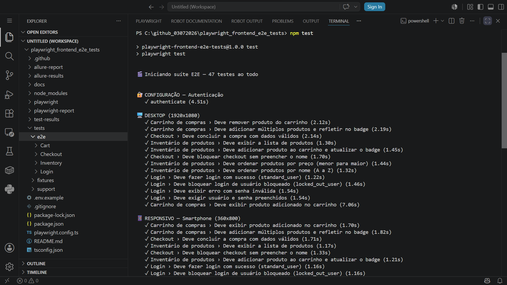
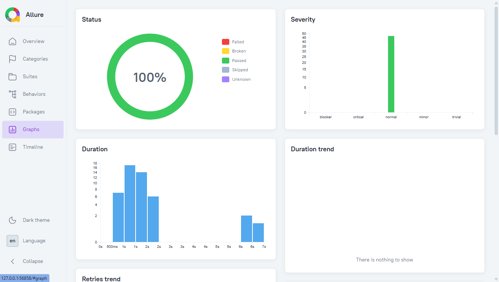
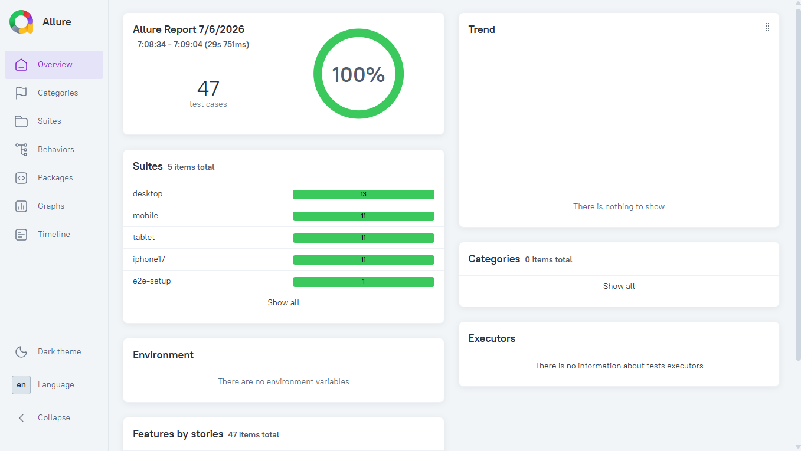
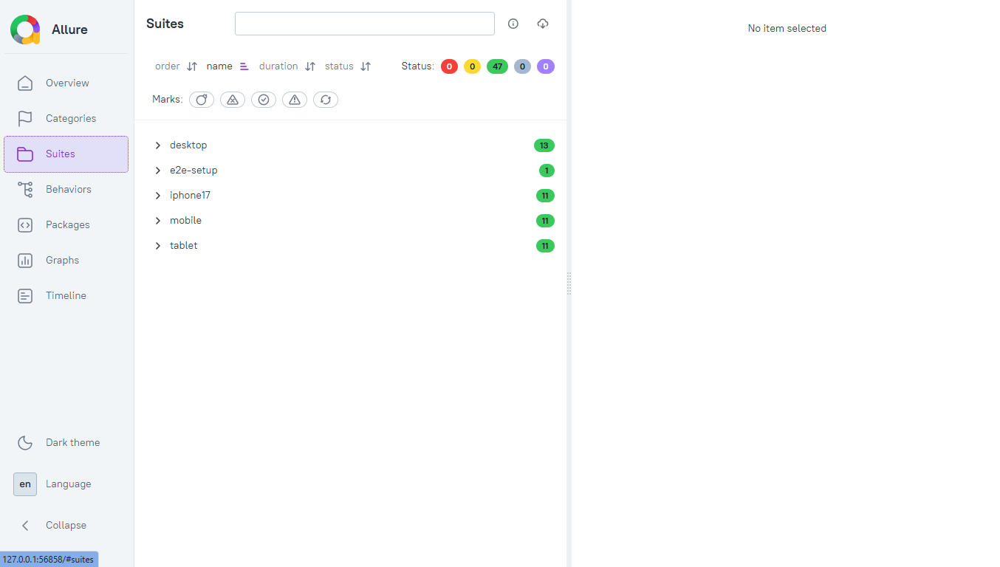
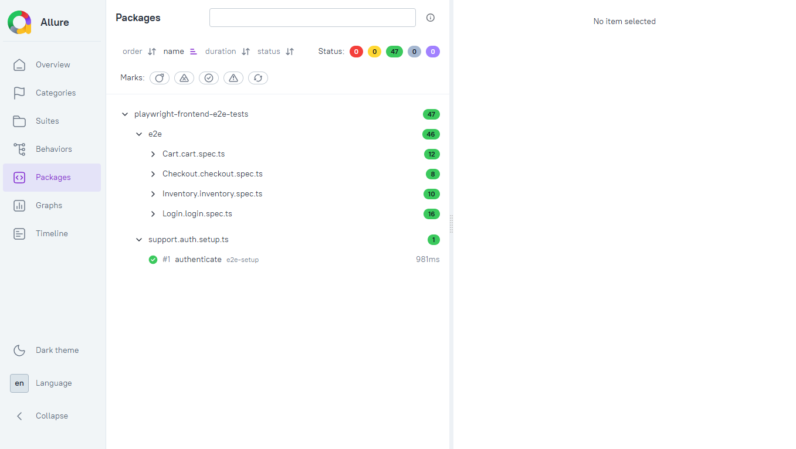
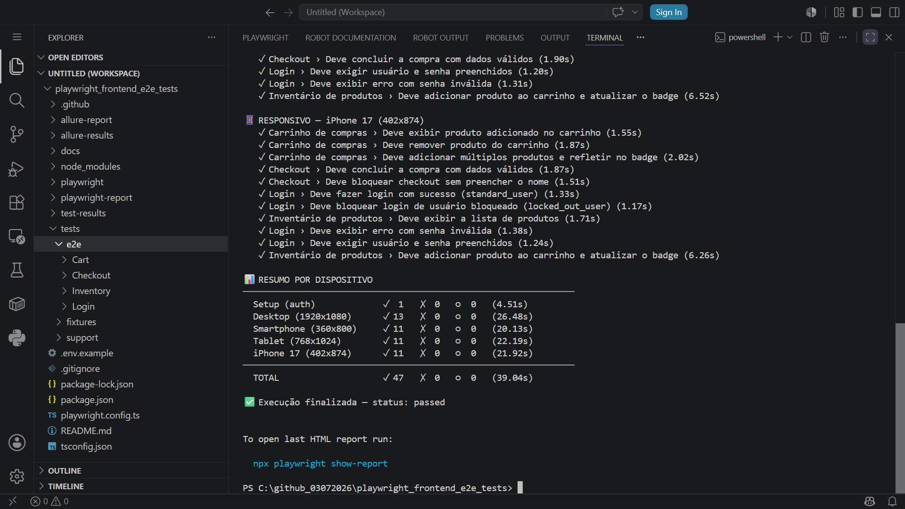

# Playwright Frontend E2E Tests

Suite de testes E2E **multi-dispositivo e responsivo** (Desktop, Tablet, Smartphone e iPhone 17), com Playwright + TypeScript e Page Object Model, contra o [SauceDemo](https://www.saucedemo.com) — um site público mantido pela Sauce Labs especificamente para prática de automação de testes.


## 🚀 Como Começar

```bash
# 1. Clone o repositório
git clone https://github.com/moiseschiaretto/Playwright_Frontend_E2E_Tests.git
cd Playwright_Frontend_E2E_Tests

# 2. Instale as dependências
npm install
npx playwright install --with-deps chromium

# 3. Rode os testes
npm test

# Ou rode por dispositivo (valida o layout responsivo em cada breakpoint):
npm run test:desktop
npm run test:mobile
npm run test:tablet
npm run test:iphone17

# Interface visual (recomendado para explorar o projeto)
npm run test:ui
```

## Relatório Allure

```bash
npm run test:allure:open   # roda os testes, gera o relatório E JÁ ABRE no navegador
```

> ⚠️ **Não abra `allure-report/index.html` direto no navegador** (duplo clique / `file://`). O Allure carrega os dados via requisições JS, que o Chrome/Firefox bloqueiam por segurança quando o arquivo é aberto localmente sem servidor — a página abre em branco. É por isso que o comando acima usa `allure:open` no final, em vez de só gerar o HTML.

Se preferir só gerar sem abrir automaticamente (por exemplo, pra anexar em outro lugar depois):

```bash
npm run test:allure         # roda os testes + gera o relatório, mas NÃO abre sozinho
npm run allure:open          # abre o relatório já gerado, quando você quiser
```

Comandos individuais, se preferir rodar por etapas:

```bash
npm run allure:clean      # limpa allure-results/ e allure-report/
npm test                    # gera allure-results/ (reporter já configurado no playwright.config.ts)
npm run allure:generate    # gera o HTML a partir dos resultados
npm run allure:open         # serve e abre o relatório
```

Relatório HTML nativo do Playwright: `npm run report`

### 📸 Execução dos testes

**Terminal (VSCode) — 47 testes passando, agrupados por dispositivo:**





### 📸 Relatório Allure em execução

**Visão geral — 47 casos de teste, 100% de sucesso, divididos em 5 suítes (desktop, mobile, tablet, iphone17, e2e-setup):**



**Suítes — testes organizados por projeto/dispositivo, incluindo o iPhone 17:**



**Pacotes — testes agrupados por spec (Cart, Checkout, Inventory, Login, auth.setup):**



**Gráficos — status, gravidade e duração dos testes:**



---

## Por que o SauceDemo como alvo

Diferente de um site comercial real, o SauceDemo é **construído pela Sauce Labs deliberadamente para não mudar** — é o "ambiente de prática" oficial da própria empresa por trás do Sauce Labs, usado por milhares de squads de QA no mundo todo para aprender e demonstrar automação. Isso significa:

- Sem risco de o layout mudar e quebrar os testes do dia pra noite
- Sem bloqueio anti-bot (ao contrário de sites comerciais reais)
- Usuários de teste **documentados oficialmente na própria tela de login** (`standard_user`, `locked_out_user`, `problem_user`, `performance_glitch_user`, `error_user`, `visual_user` — todos com a senha `secret_sauce`), o que permite testar cenários de autenticação variados (sucesso, bloqueio, erro) sem precisar de conta própria

## O que este projeto cobre

- **Login** — sucesso, usuário bloqueado, senha inválida, campos obrigatórios
- **Inventário** — listagem de produtos, adicionar ao carrinho, ordenação (preço e nome)
- **Carrinho** — adicionar/remover produtos, contagem de itens
- **Checkout** — fluxo completo de compra, validação de campos obrigatórios

## Arquitetura

```
tests/
  e2e/
    Login/login.spec.ts
    Inventory/inventory.spec.ts
    Cart/cart.spec.ts
    Checkout/checkout.spec.ts
  support/
    pages/                       # Page Object Model — locators como getters, page privado
      Login/loginPage.ts
      Inventory/inventoryPage.ts
      Cart/cartPage.ts
      Checkout/checkoutPage.ts
    constants/routes.constants.ts # rotas e slugs de produto — zero valor solto em spec/page object
    config/environments.ts        # URL base do site público
    helpers/
      credentials.ts               # usuários de demonstração (públicos, documentados)
      projectDevice.helper.ts       # isMobileProject / isTabletProject
    schemas.ts                     # validação Zod dos dados de teste (testData.json)
    auth.setup.ts                  # login único, reaproveitado entre testes via storageState
  fixtures/
    testData.example.json          # template committed
    testData.json                  # dados reais (gitignored — convenção mesmo sem dado sensível)
docs/
  screenshots/                    # capturas de tela do relatório Allure
```

## Convenções de código aplicadas

Esse projeto segue um conjunto de regras de code review que uso em projetos reais de automação:

- **Locators como `get`**, nunca `readonly` no constructor — sempre retornam um locator fresco, evitando referências obsoletas
- **`page` é `private readonly`** em toda Page Object — encapsulamento, ninguém acessa `page` de fora da classe
- **Zero valor hardcoded** em spec ou Page Object — rotas e slugs vêm de `routes.constants.ts`, dados de massa vêm de `testData.json` validado via Zod
- **Testes deslogados** sobrescrevem explicitamente `test.use({ storageState: { cookies: [], origins: [] } })`
- **Proibido `waitForTimeout`** — todas as esperas usam auto-wait nativo do Playwright (`waitForURL`, assertions com retry)
- **Proibido `click({ force: true })`** — nenhum clique forçado no projeto
- **`npx tsc --noEmit` limpo** — projeto passa no type-check sem nenhum erro

## Multi-dispositivo e responsivo — dependências de setup

O `playwright.config.ts` define 5 projetos, validando o comportamento **responsivo** da aplicação em quatro breakpoints reais:

| Projeto | Dispositivo (resolução) | Depende de auth? |
|---|---|---|
| `e2e-setup` | — | executa o login e salva a sessão |
| `desktop` | Desktop (1920x1080) | sim (via `dependencies`) |
| `mobile` | Smartphone (360x800) | sim |
| `tablet` | Tablet (768x1024) | sim |
| `iphone17` | iPhone 17 (402x874) | sim |

Isso evita logar de novo a cada teste — o login roda **uma única vez** por execução, e todos os testes autenticados reaproveitam essa sessão salva (`playwright/.auth/user.json`, fora do versionamento).

Testes que precisam começar deslogados (como os cenários de erro de login) usam `test.use({ storageState: { cookies: [], origins: [] } })` para ignorar a sessão salva nesse teste específico.

### Tags de dispositivo

- `@desktop-only` — roda só no projeto `desktop` (ex: teste de ordenação, que depende de um dropdown pouco usável em mobile)
- `@compact-only` — roda só em `mobile`/`tablet`/`iphone17`
- sem tag — roda em todos os dispositivos

## Dados sensíveis

Este projeto **não usa nenhum dado de cliente real** — nem endpoint, nem credencial, nem estrutura de negócio proprietária. Tudo aqui roda contra a instância pública do SauceDemo, com usuários de demonstração oficialmente documentados pela Sauce Labs.

## CI

O workflow (`.github/workflows/e2e-tests.yml`) roda a cada push/PR na `main` e também toda segunda-feira — a execução semanal serve como um "canário": se o SauceDemo mudar algo inesperado, o CI avisa antes de você precisar descobrir na próxima vez que abrir o projeto.
